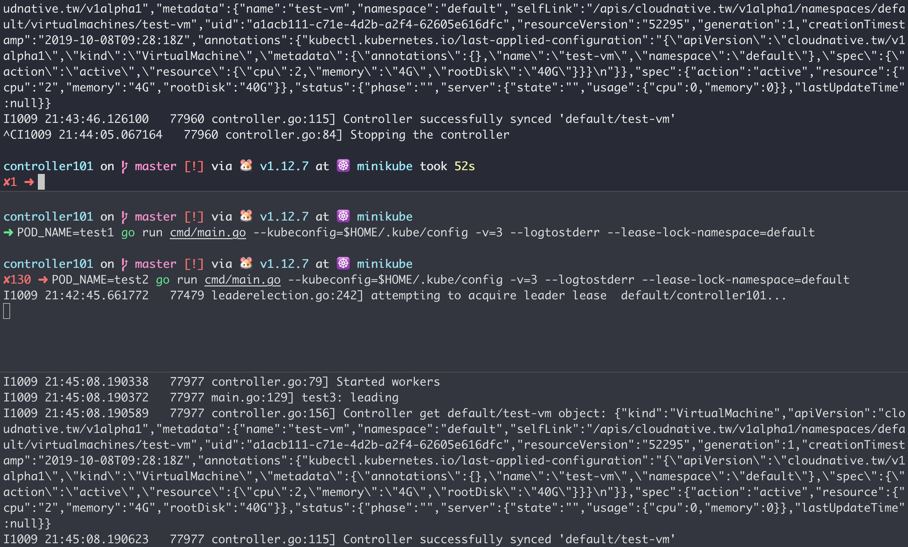

# 動手實作 Kubernetes 自定義控制器 Part3

https://k2r2bai.com/2019/10/12/ironman2020/day27/

## 前言

在[動手實作 Kubernetes 自定義控制器 Part2](https://k2r2bai.com/2019/10/11/ironman2020/day26/) 文章中，我們利用 client-go 與產生的 Client 函式庫實作了一個控制器功能。而今天想在控制器實現協調預期狀態之前，探討一下 Kubernetes 自定義控制器的高可靠(Highly Available，HA)如何實現。

在 Kubernetes 中，許多系統相關元件都是以 [Controller Pattern](https://kubernetes.io/docs/concepts/extend-kubernetes/#extension-patterns) 方式實現，比如說: Scheduler 與 Controller Manager。這些元件通常負責 Kubernetes 中的某一環核心功能，像是 Scheduler 負責 Pod 的節點分配， Controller Manager 提供許多 Kubernetes API 資源的功能協調與關聯。那麼如果這些元件發生故障了，就可能造成某部分功能無法正常運行，進而影響到整個叢集的健康，這樣該如何解決呢?

如果有閱讀過[淺談 Kubernetes 高可靠架構](https://k2r2bai.com/2019/09/19/ironman2020/day04/)與[實現 Kubernetes 高可靠架構部署](https://k2r2bai.com/2019/09/20/ironman2020/day05/)文章的人，可以從中知道 Kubernetes 的核心元件都支援 HA 的部署實現。而其中的兩個重要控制器 Scheduler 與 Controller Manager 是以 [Lease](https://en.wikipedia.org/wiki/Lease_(computer_science)) 機制實現 Active-Passive 架構。這表示一個環境中，有多個相同元件運作時，只會有一個作為 Leader 負責程式的功能，而其餘則會等待 Leader 發生錯時，才接手工作。

而這機制的實踐方式有很多種，比如基於 Redis、Zookeeper、Consul、etcd，或是資料庫的分散式鎖(Distributed Lock)。而 Kubernetes 則是是採用資源鎖(Resource Lock)概念來實現，基本上就是建立 Kubernetes API 資源 ConfigMap、 Endpoint 或 [Lease](https://github.com/kubernetes/api/blob/master/coordination/v1/types.go#L27) 來維護分散式鎖的狀態。

> Kubernetes 從 v1.15 版本開始推薦使用 Lease 資源實現，而 ConfigMap、 Endpoint 已經被棄用。

分散式鎖最常見的實現方式就是搶資源的擁有權，搶到的人就是 Leader，接著 Leader 開始定期更新鎖狀態，以表示自己處於活躍狀態，以確保其他人沒辦法搶走擁有權。而 Kubernetes 也類似這樣概念，基本上就是搶 API 上的某個資源，當搶到時，就在該資源中標示自己是擁有者，並持續更新時間來表示自己還處於活躍狀態;而其他則持續取得資源鎖中的更新時間進行比對，以確認原擁有者是否已經死亡，若是的話，則更新資源鎖來標示自己為擁有者。

這邊看一下 Kubernetes Controller Manager 實際運作狀況，當 Controller Manager 被啟動時，預設會透過 `--leader-elect=true` 來開啟 HA 功能。當正確啟動後，在 kube-system 底下，就會看到被新增了一個用於維護分散式鎖狀態的 Endpoint 資源:

```
$ kubectl -n kube-system get ep kube-controller-manager -o yaml
apiVersion: v1
kind: Endpoints
metadata:
  annotations:
    control-plane.alpha.kubernetes.io/leader: '{"holderIdentity":"k8s-m3_9f51cc32-679e-4cc3-951e-c35f8688bbc3","leaseDurationSeconds":15,"acquireTime":"2019-09-25T05:39:17Z","renewTime":"2019-10-09T09:37:48Z","leaderTransitions":6}'
  creationTimestamp: "2019-09-20T14:00:55Z"
  name: kube-controller-manager
  namespace: kube-system
```

然後可以在該資源的 `metadata.annotations` 看到用於儲存狀態的 `control-plane.alpha.kubernetes.io/leader` 欄位。其中 `holderIdentity` 用於表示當前擁有者，`acquireTime` 為擁有者取得持有權的時間，`renewTime` 為當前擁有者上一次活躍時間。而更換 Leader 條件是當 renewTime 與自己當下時間計算超過 `leaseDurationSeconds` 時進行。

當確認 Leader 後，即可透過 kubectl logs 來查看元件執行結果:

```bash
# Leader
$ kubectl -n kube-system logs -f kube-controller-manager-k8s-m3
I0923 14:02:27.809016       1 serving.go:319] Generated self-signed cert in-memory
I0923 14:02:28.214820       1 controllermanager.go:161] Version: v1.16.0
I0923 14:02:28.215142       1 secure_serving.go:123] Serving securely on 127.0.0.1:10257
I0923 14:02:28.215415       1 deprecated_insecure_serving.go:53] Serving insecurely on [::]:10252
I0923 14:02:28.215453       1 leaderelection.go:241] attempting to acquire leader lease  kube-system/kube-controller-manager...
I0925 05:39:17.506983       1 leaderelection.go:251] successfully acquired lease kube-system/kube-controller-manager
I0925 05:39:17.507091       1 event.go:255] Event(v1.ObjectReference{Kind:"Endpoints", Namespace:"kube-system", Name:"kube-controller-manager", UID:"b6627d30-c879-449f-99ea-f94d536f2516", APIVersion:"v1", ResourceVersion:"794261", FieldPath:""}): type: 'Normal' reason: 'LeaderElection' k8s-m3_9f51cc32-679e-4cc3-951e-c35f8688bbc3 became leader
I0925 05:39:17.766322       1 plugins.go:100] No cloud provider specified.
I0925 05:39:17.767107       1 shared_informer.go:197] Waiting for caches to sync for tokens
I0925 05:39:17.778474       1 controllermanager.go:534] Started "daemonset"
I0925 05:39:17.778485       1 daemon_controller.go:267] Starting daemon sets controller
I0925 05:39:17.778505       1 shared_informer.go:197] Waiting for caches to sync for daemon sets
...

# Not leader
$ kubectl -n kube-system logs -f kube-controller-manager-k8s-m1
I0925 05:39:06.784042       1 serving.go:319] Generated self-signed cert in-memory
I0925 05:39:07.932147       1 controllermanager.go:161] Version: v1.16.0
I0925 05:39:07.932782       1 secure_serving.go:123] Serving securely on 127.0.0.1:10257
I0925 05:39:07.933364       1 deprecated_insecure_serving.go:53] Serving insecurely on [::]:10252
I0925 05:39:07.933418       1 leaderelection.go:241] attempting to acquire leader lease  kube-system/kube-controller-manager...
```

講了這麼多，那究竟該如何在自己的控制器實現同樣功能呢?

事實上，Kubernetes client-go 提供了 [Leader Election](https://github.com/kubernetes/client-go/tree/master/tools/leaderelection) 功能，因此我們能夠透過這個 Package 輕易實作。

## Use Leader Election Package

在 client-go 中，以提供了 [Leader Election Example](https://github.com/kubernetes/client-go/tree/master/examples/leader-election) 讓大家可以了解如何實現。因此可以下載 client-go 來進行測試，或是依據範例在控制器中實作。

### 環境準備

由於使用這個功能需要用到 Kubernetes 與 Go 語言，因此需要透過以下來完成條件:

- 一座 Kubernetes v1.10+ 叢集。透過 [Minikube](https://github.com/kubernetes/minikube) 建立即可 `minikube start --kubernetes-version=v1.15.4`。

- 安裝 Go 語言 v1.11+ 開發環境，由於開發中會使用到 Go mod 來管理第三方套件，因此必須符合支援版本。安裝請參考 [Go Getting Started](https://golang.org/doc/install)。

### 在控制器實作

要在自定義控制器中，應用 Leader Election 機制其實不難，只要參考 client-go 的範例，在`OnStartedLeading()`函式中執行控制器程式實例的啟動函式即可，而當觸發`OnStoppedLeading()`時，就關閉控制器程式的運作。如以下程式，我們修改 [Controller101](https://github.com/cloud-native-taiwan/controller101) 的 main.go。

```bash
package main

import (
	"context"
	goflag "flag"
	"fmt"
	"os"
	"os/signal"
	"syscall"
	"time"

	"github.com/cloud-native-taiwan/controller101/pkg/controller"
	cloudnative "github.com/cloud-native-taiwan/controller101/pkg/generated/clientset/versioned"
	cloudnativeinformer "github.com/cloud-native-taiwan/controller101/pkg/generated/informers/externalversions"
	"github.com/cloud-native-taiwan/controller101/pkg/version"
	flag "github.com/spf13/pflag"
	metav1 "k8s.io/apimachinery/pkg/apis/meta/v1"
	clientset "k8s.io/client-go/kubernetes"
	"k8s.io/client-go/rest"
	"k8s.io/client-go/tools/clientcmd"
	"k8s.io/client-go/tools/leaderelection"
	"k8s.io/client-go/tools/leaderelection/resourcelock"
	"k8s.io/klog"
)

const defaultSyncTime = time.Second * 30

var (
	kubeconfig         string
	showVersion        bool
	threads            int
	leaderElect        bool
	id                 string
	leaseLockName      string
	leaseLockNamespace string
)

func parseFlags() {
	flag.StringVarP(&kubeconfig, "kubeconfig", "", "", "Absolute path to the kubeconfig file.")
	flag.IntVarP(&threads, "threads", "", 2, "Number of worker threads used by the controller.")
	flag.StringVarP(&id, "holder-identity", "", os.Getenv("POD_NAME"), "the holder identity name")
	flag.BoolVarP(&leaderElect, "leader-elect", "", true, "Start a leader election client and gain leadership before executing the main loop. ")
	flag.StringVar(&leaseLockName, "lease-lock-name", "controller101", "the lease lock resource name")
	flag.StringVar(&leaseLockNamespace, "lease-lock-namespace", "", "the lease lock resource namespace")
	flag.BoolVarP(&showVersion, "version", "", false, "Display the version.")
	flag.CommandLine.AddGoFlagSet(goflag.CommandLine)
	flag.Parse()
}

func restConfig(kubeconfig string) (*rest.Config, error) {
	if kubeconfig != "" {
		cfg, err := clientcmd.BuildConfigFromFlags("", kubeconfig)
		if err != nil {
			return nil, err
		}
		return cfg, nil
	}

	cfg, err := rest.InClusterConfig()
	if err != nil {
		return nil, err
	}
	return cfg, nil
}

func main() {
	parseFlags()

	if showVersion {
		fmt.Fprintf(os.Stdout, "%s\n", version.GetVersion())
		os.Exit(0)
	}

	k8scfg, err := restConfig(kubeconfig)
	if err != nil {
		klog.Fatalf("Error to build rest config: %s", err.Error())
	}

	k8sclientset := clientset.NewForConfigOrDie(k8scfg)
	clientset, err := cloudnative.NewForConfig(k8scfg)
	if err != nil {
		klog.Fatalf("Error to build cloudnative clientset: %s", err.Error())
	}

	informer := cloudnativeinformer.NewSharedInformerFactory(clientset, defaultSyncTime)
	controller := controller.New(clientset, informer)
	ctx, cancel := context.WithCancel(context.Background())
	signalChan := make(chan os.Signal, 1)
	signal.Notify(signalChan, syscall.SIGINT, syscall.SIGTERM)

	if leaderElect {
		lock := &resourcelock.LeaseLock{
			LeaseMeta: metav1.ObjectMeta{
				Name:      leaseLockName,
				Namespace: leaseLockNamespace,
			},
			Client: k8sclientset.CoordinationV1(),
			LockConfig: resourcelock.ResourceLockConfig{
				Identity: id,
			},
		}
		go leaderelection.RunOrDie(ctx, leaderelection.LeaderElectionConfig{
			Lock:            lock,
			ReleaseOnCancel: true,
			LeaseDuration:   60 * time.Second,
			RenewDeadline:   15 * time.Second,
			RetryPeriod:     5 * time.Second,
			Callbacks: leaderelection.LeaderCallbacks{
				OnStartedLeading: func(ctx context.Context) {
					if err := controller.Run(ctx, threads); err != nil {
						klog.Fatalf("Error to run the controller instance: %s.", err)
					}
					klog.Infof("%s: leading", id)
				},
				OnStoppedLeading: func() {
					controller.Stop()
					klog.Infof("%s: lost", id)
				},
			},
		})
	} else {
		if err := controller.Run(ctx, threads); err != nil {
			klog.Fatalf("Error to run the controller instance: %s.", err)
		}
	}

	<-signalChan
	cancel()
	controller.Stop()
}
```

### 執行

當程式開發完成後，就可以開啟三個單獨的 Terminal 來測試，其中每個 Terminal 會輸入一個唯一的 POD Name 來驗證:

```bash
# first terminal 
$ POD_NAME=test1 go run cmd/main.go --kubeconfig=$HOME/.kube/config -v=3 --logtostderr --lease-lock-namespace=default

# second terminal 
$ POD_NAME=test2 go run cmd/main.go --kubeconfig=$HOME/.kube/config -v=3 --logtostderr --lease-lock-namespace=default

# third terminal
$ POD_NAME=test3 go run cmd/main.go --kubeconfig=$HOME/.kube/config -v=3 --logtostderr --lease-lock-namespace=default
```

當三個控制器都啟動後，就會看到其中一個行程被選擇 Leader，這時如果停止該控制器，並經過一段時間後，就會發現新的 Leader 已經由其他行程接手。



## 結語

今天主要透過 client-go 為自定義控制器實現高可靠機制，以確保控制器在發生問題時，能由其他節點上的控制器接手處理，這樣功能很適合以 Static Pod 部署的控制器。

> 自定義控制器其實也可以用 Kubernetes Deployment 來達到高可靠，但在一些場景下並不適用，且若 Deployment 因為一些原因同時有多個副本在執行時，有可能會發生多個控制器寫入同一個 API 資源，造成資訊不一致問題。

明天我們將回到 VM 控制器程式，深入了解如何實現核心功能，以讓我們透過 API 資源管理虛擬機。
